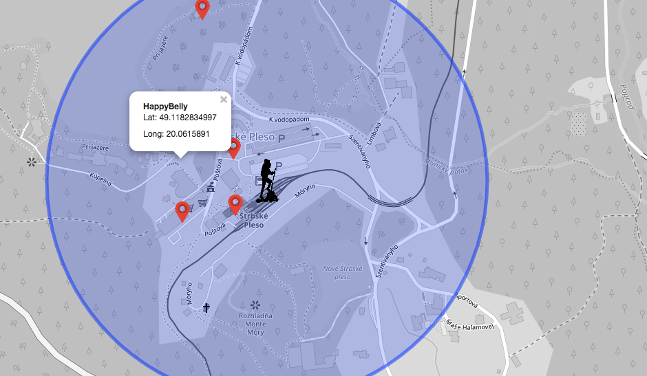

# Overview
Aplikácia ponúka zobrazenie rôznych artefaktov na mape v oblasti Vysokých Tatier. Najdôležitejšie features sú:
- zobrazenie vybratých miest (požičovňa lyží, bary, lekárne, ...) vzhľadom na aktuálnu pozíciu
- vybratie si rozsahu hľadania miest na základe počtu m a km od aktuálnej pozície
- nasimulovanie aktuálnej pozície
- zobrazenie top najbližšieho ubytovania podľa určeného limitu a aktuálnej pozície
- zobrazenie cyklotrás spolu s bodmi, ktoré tieto cesty pretínajú
- zobrazenie plôch s artefaktami, ktoré sa tam nachádzajú 

Takto vyzerá aplikácia v chode:

Aplikácia je rozdelená na 2 časti - frontend, ktorý využíva Leaflet na zobrazovanie mapy a backend, ktorý je napísaný v Pythone spolu s frameworkom Flask. 

# Frontend
Frontend je vytvorený pomocou dvoch statických HTML stránok ('index.html' a 'polygons.html'). Mapa je zobrazovaná pomocou knižnice leaflet. Zobrazuje oblasť Vysokých Tatier spolu s vrcholmi pohorí, riekami, mestami a cestami medzi nimi. Ubytovanie sa zvýrazňuje pomocou žlej farby, cesty sú zobrazované pomocou červenej farby. Markery sú použité ako obrázky vložené do HTML kódu. Aktuálna pozícia je zobrazovaná pomocou obrázku čierneho turistu. Okruh okolo turistu je zobrazovaný modrofialovým kruhom. V tomto prípade bola ponechaná defaultná farba. V hornej časti aplikácie sa nachádza menu, kde môže používateľ selectovať artefakty, alebo vybrať iné zobrazenia.

# Backend

Backendová časť aplikácie je napísaná v jazyku Python v spolupráci s frameworkom Flask. Na prácu s databázou je využívaná knižnica [psycopg](http://initd.org/psycopg/docs/index.html). Python a Flask rieši aj spracovanie dát a formátovanie údajov.

## Dáta

Dáta sú stiahnuté priamo z Open Street Maps. Stiahnutá je časť Vysokých Tatier ako na Slovensku tak aj v Poľsku a importovaná je pomocou 'osm2pgsql' a návodu na githube. Pre zrýchlenie dopytov som vytvorila indexy - way (v tabuľke planet_osm_line a planet_osm_point), bicycle (tabuľka planet_osm_point) a amenity (tabuľka planet_osm_point). Všetky dopyty sú tvorené pomocou psycpg.cursor("dopyt"). 
