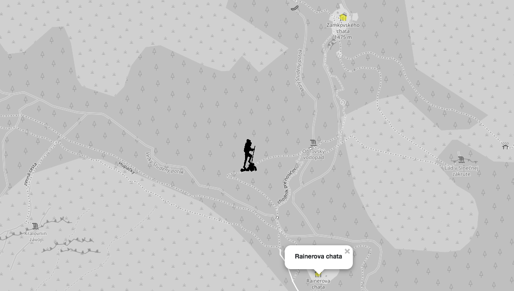

SLESARIKOVA TATIANA
# Úvod
Aplikácia ponúka zobrazenie rôznych artefaktov na mape v oblasti Vysokých Tatier. Najdôležitejšie features sú:
- zobrazenie vybratých miest (požičovňa lyží, bary, lekárne, ...) vzhľadom na aktuálnu pozíciu
- vybratie si rozsahu hľadania miest na základe počtu m a km od aktuálnej pozície
- nasimulovanie aktuálnej pozície
- zobrazenie top najbližšieho ubytovania podľa určeného limitu zobrazených ubytovaní a aktuálnej pozície
- zobrazenie cyklotrás spolu s bodmi, ktoré tieto cesty pretínajú
- zobrazenie väčších plôch s kultúrnymi atrakciami, ktoré sa tam nachádzajú 

Takto vyzerá aplikácia v chode:





Aplikácia je rozdelená na 2 časti - frontend, ktorý využíva Leaflet na zobrazovanie mapy a backend, ktorý je napísaný v Pythone spolu s frameworkom Flask. 

# Frontend
Frontend je vytvorený pomocou dvoch statických HTML stránok ('index.html' a 'polygons.html'). Mapa je zobrazovaná pomocou knižnice leaflet. Zobrazuje oblasť Vysokých Tatier spolu s vrcholmi pohorí, riekami, mestami a cestami medzi nimi. Ubytovanie sa zvýrazňuje pomocou žlej farby, cesty sú zobrazované pomocou červenej farby. Markery sú použité ako obrázky vložené do HTML kódu. Aktuálna pozícia je zobrazovaná pomocou obrázku čierneho turistu. Okruh okolo turistu je zobrazovaný modrofialovým kruhom. V tomto prípade bola ponechaná defaultná farba. V hornej časti aplikácie sa nachádza menu, kde môže používateľ selectovať artefakty, alebo vybrať iné zobrazenia.

# Backend

Backendová časť aplikácie je napísaná v jazyku Python v spolupráci s frameworkom Flask. Na prácu s databázou je využívaná knižnica [psycopg](http://initd.org/psycopg/docs/index.html). Python a Flask rieši aj spracovanie dát a formátovanie údajov.

## Dáta

Dáta sú stiahnuté priamo z Open Street Maps. Stiahnutá je časť Vysokých Tatier ako na Slovensku tak aj v Poľsku a importovaná je pomocou 'osm2pgsql' a návodu na githube. Pre zrýchlenie dopytov som vytvorila indexy - way (v tabuľke planet_osm_line a planet_osm_point), bicycle (tabuľka planet_osm_point) a amenity (tabuľka planet_osm_point). Všetky dopyty sú tvorené pomocou psycpg.cursor("dopyt").

## Query
1. scenár - zobrazenie vybratých miest (požičovňa lyží, bary, lekárne, ...) vzhľadom na aktuálnu pozíciu
```postgres
SELECT body.name, ST_AsText(body.cesta)
FROM(
	SELECT name, ST_Transform (way, 4326) as cesta 
	FROM planet_osm_point 
	WHERE amenity='parking')  as body
WHERE ST_Distance_Sphere(ST_setSRID(ST_MakePoint(20.2096027, 49.1390668), 4326), body.cesta) < 10000
```

2. scenár - zobrazenie top najbližšieho ubytovania podľa určeného limitu zobrazených ubytovaní a aktuálnej pozície
```postgres
SELECT polygons.coordinaty, polygons.cesta, polygons.name FROM (
SELECT ST_AsText (ST_Transform (way, 4326)) AS coordinaty, name, tourism, 
  		ST_Distance_Sphere(ST_setSRID(ST_MakePoint(20.2096027, 49.1390668), 4326), 
  		ST_Transform(ST_Centroid(way), 4326))  AS cesta
FROM planet_osm_polygon
WHERE tourism!='null') AS polygons
ORDER BY polygons.cesta
LIMIT 10
```

3. scenár - zobrazenie cyklotrás spolu s bodmi, ktoré tieto cesty pretínajú
```postgres
SELECT points.name, lines.name, ST_Intersects(ST_Transform(points.way, 4326), ST_Transform(lines.way, 4326)), 
       ST_AsText(ST_Transform(points.way, 4326)), ST_AsText(ST_Transform(lines.way, 4326)) 
FROM planet_osm_line as lines 
INNER JOIN planet_osm_point AS points ON (lines.bicycle = points.bicycle)
WHERE lines.bicycle='yes' and ST_Intersects(ST_Transform(points.way, 4326), ST_Transform(lines.way, 4326))='true'
```
4. scenár - zobrazenie väčších plôch s kultúrnymi atrakciami, ktoré sa tam nachádzajú
```postgres
SELECT polygon.name, ST_AsText(ST_Transform(polygon.way, 4326)), points.name,
		ST_AsText(St_Transform(points.way, 4326)), ST_Contains(polygon.way, points.way)
FROM planet_osm_polygon AS polygon
INNER JOIN planet_osm_point AS points ON (polygon.amenity = points.amenity)
```
WHERE ST_Contains(polygon.way, points.way)='true'

## Indexy
Na základe dopytov a dĺžky trvania vyhodnotenia som vytvorila takéto indexy:

```postgres
CREATE INDEX planet_osm_point_way ON planet_osm_point USING gist (way)
CREATE INDEX planet_osm_point_amenity ON planet_osm_point USING gist (amenity)

CREATE INDEX planet_osm_line_way ON planet_osm_line USING gist (way)
CREATE INDEX planet_osm_line_bicycle ON planet_osm_line USING gist (bicycle)
```

## API

zobrazenie väčších plôch s kultúrnymi atrakciami, ktoré sa tam nachádzajú
```
GET http://127.0.0.1:5000/searchAtraction
```
example response

```json
[
	"Zvestovania P\u00e1na", 
	"{\"type\":\"Polygon\",\"coordinates\":[[[2256088.37545989,6295638.79979225],[2256088.73168226,6295636.72460738],[2256092.81710757,6295637.35396668],[2256097.34781085,6295635.89113164],[2256096.17895619,6295632.7783556],[2256101.54455565,6295630.60111403],[2256099.66325626,6295625.87241942],[2256103.97132055,6295624.22247984],[2256105.85261994,6295628.93416383],[2256114.91402649,6295625.26007067],[2256115.459492,6295626.824962],[2256124.23146787,6295623.33797628],[2256129.9087619,6295636.89470449],[2256119.71189655,6295640.68787073],[2256118.84360452,6295638.52763683],[2256101.62247929,6295645.53564174],[2256100.54268023,6295642.7800663],[2256095.65575459,6295644.80422348],[2256094.39784434,6295647.21960495],[2256092.95069096,6295646.53921574],[2256094.08614977,6295643.74962052],[2256092.18258647,6295639.24204483],[2256088.37545989,6295638.79979225]]]}", 
	"nothing", 
	"{\"type\":\"Point\",\"coordinates\":[2256120.76943171,6295632.96546232]}", 
	"True"
],
[
	"Klasztor Albertynek na Kalat\u00f3wkach", 
	"{\"type\":\"Polygon\",\"coordinates\":[[[2223564.74982812,6319771.19382654],[2223592.95818709,6319756.94999299],[2223594.40534047,6319759.81581624],[2223602.88788567,6319755.55119865],[2223588.26050457,6319726.4153891],[2223585.17695468,6319727.96770428],[2223577.70741685,6319713.12690054],[2223580.61285556,6319711.65987999],[2223578.14156286,6319706.74706882],[2223600.42772492,6319695.48855404],[2223602.32015626,6319699.22433228],[2223605.74879658,6319697.48438056],[2223617.29262777,6319720.47906556],[2223600.68375975,6319728.87180006],[2223613.79719576,6319755.50002326],[2223620.88824733,6319751.91774617],[2223625.15178382,6319760.3958044],[2223605.33691446,6319770.39207719],[2223602.08638533,6319763.89279268],[2223569.38071894,6319780.40542036],[2223564.74982812,6319771.19382654]]]}", 
	"Kaplica Ku\u017anice", 
	"{\"type\":\"Point\",\"coordinates\":[2223587.28089306,6319763.85867571]}",
	"True"
]
```

zobrazenie cyklotrás spolu s bodmi, ktoré tieto cesty pretínajú
```
GET http://127.0.0.1:5000/searchRoads
```
example response
```json
[
	"Hrebienok", 
	"{\"type\":\"Point\",\"coordinates\":[2251430.52306222,6301852.47446438]}", 
	"nothing", 
	"{\"type\":\"LineString\",\"coordinates\":[[2251219.33885624,6300306.02556914],[2251233.49869546,6300319.65790322],[2251252.26716161,6300328.21854375],[2251285.28452258,6300342.90610431],[2251319.33715481,6300356.45340185],[2251357.63105965,6300376.57015771],[2251370.71109982,6300388.58577251],[2251373.67219827,6300391.3088604],[2251385.30508506,6300408.8727984],[2251394.44441525,6300431.21921815],[2251401.47980707,6300449.87248211],[2251403.86204417,6300469.6660911],[2251403.37223841,6300509.62787836],[2251402.27017546,6300545.50514683],[2251404.88618349,6300560.9759895],[2251413.52457597,6300574.54065709],[2251430.33381908,6300592.93894248],[2251456.63861476,6300621.85547771],[2251477.43309564,6300644.42371948],[2251503.09223827,6300681.57805302],[2251530.09834673,6300739.05441054],[2251547.17475662,6300787.25519956],[2251562.70382559,6300840.68146671],[2251568.19187648,6300862.45034228],[2251567.49056369,6300877.24095516],[2251566.02114641,6300892.0486143],[2251545.96137417,6300938.63333915],[2251517.12962606,6300998.15391198],[2251503.3260092,6301019.61682385],[2251483.46661204,6301040.02451237],[2251453.75543995,6301064.02360877],[2251392.16236569,6301101.50318533],[2251383.24567448,6301107.23917519],[2251350.66245952,6301128.20876183],[2251330.65834703,6301141.74030038],[2251315.57455603,6301152.37831763],[2251309.76367861,6301165.65458198],[2251310.95479716,6301178.82874189],[2251317.90113338,6301189.10936676],[2251331.31513202,6301202.16441675],[2251344.61781117,6301217.77263212],[2251356.3954133,6301233.73831743],[2251368.70734898,6301253.39759833],[2251385.76149497,6301287.35464604],[2251401.1235847,6301324.73308827],[2251411.09781108,6301342.84364993],[2251428.30780435,6301365.12446007],[2251459.19896305,6301401.89047874],[2251494.68761671,6301449.70356414],[2251510.5395122,6301472.97190279],[2251517.29660529,6301486.75931737],[2251523.94237889,6301504.73405467],[2251531.93511833,6301537.67081764],[2251539.37126032,6301572.37796447],[2251546.25080485,6301611.13643315],[2251552.21752955,6301644.2438301],[2251554.45505132,6301659.76775458],[2251561.06742907,6301673.57249652],[2251574.93783762,6301694.90095237],[2251585.06791129,6301703.63320883],[2251595.36496419,6301711.36117824],[2251610.13706061,6301715.24218758],[2251626.52328966,6301717.09758302],[2251643.77781073,6301715.70178091],[2251665.06209737,6301711.29309038],[2251686.19053672,6301704.12684543],[2251715.31171552,6301688.48368583],[2251721.71258624,6301687.0368227],[2251728.09119306,6301687.598546],[2251734.36961234,6301694.37327244],[2251735.58299479,6301703.92258201],[2251732.93359091,6301717.47206656],[2251728.67005441,6301726.8852263],[2251721.48994725,6301734.47704091],[2251707.70859429,6301740.58794598],[2251693.81592184,6301744.53705691],[2251645.81495741,6301759.02282014],[2251593.85101911,6301777.08324842],[2251545.63854765,6301797.71405831],[2251507.85671247,6301816.47247877],[2251458.54217805,6301835.97991856],[2251430.52306222,6301852.47446438]]}", 
	"True"
], 
[
	"Hrebienok", 
	"{\"type\":\"Point\",\"coordinates\":[2251430.52306222,6301852.47446438]}", 
	"nothing", 
	"{\"type\":\"LineString\",\"coordinates\":[[2250550.24192487,6303336.53690025],[2250549.9302303,6303315.22131594],[2250577.90481834,6303275.72293156],[2250601.61586987,6303211.8959766],[2250608.50654635,6303189.59326019],[2250627.26388055,6303154.86242998],[2250656.38505934,6303110.35950668],[2250684.20380009,6303087.59739075],[2250716.04117446,6303064.98855857],[2250744.27179733,6303027.22785812],[2250758.23126147,6302991.66349374],[2250767.32606387,6302969.20813942],[2250775.24087966,6302958.78914772],[2250805.18582269,6302919.3775554],[2250837.32375968,6302870.9262348],[2250852.28509924,6302834.7326331],[2250857.19428879,6302805.16158843],[2250850.06984138,6302745.62825702],[2250849.10136181,6302718.98565266],[2250853.06433568,6302688.98941548],[2250865.64343814,6302647.28086352],[2250887.71809316,6302621.43868874],[2250895.65517286,6302576.56405962],[2250929.6187495,6302535.06034743],[2250972.44335761,6302502.66444173],[2251010.91537362,6302471.64756406],[2251029.16063816,6302440.98829274],[2251059.55085915,6302413.15501417],[2251087.3250721,6302374.58011458],[2251117.47039021,6302336.68632065],[2251163.18930508,6302303.45704223],[2251184.17302909,6302271.99829689],[2251218.57075175,6302205.43824318],[2251244.36347777,6302172.61803163],[2251274.11917765,6302096.18556533],[2251287.36619706,6302053.23729203],[2251299.15493113,6302014.78319729],[2251305.05486415,6301984.99373584],[2251325.19256003,6301946.06332402],[2251339.77541332,6301929.07494529],[2251356.52899669,6301922.16385112],[2251371.4792043,6301909.6183572],[2251381.50909042,6301903.6264861],[2251393.21990085,6301902.53705544],[2251401.41301538,6301896.97074791],[2251411.75459607,6301880.59527119],[2251428.94232545,6301854.84055771],[2251430.52306222,6301852.47446438],[2251395.64666575,6301840.64400771],[2251357.40842067,6301836.88209618],[2251324.13502487,6301836.95018506],[2251295.61497133,6301832.23503133],[2251274.14144155,6301824.33672917],[2251260.19310936,6301817.51083176],[2251217.80264726,6301791.14351436]]}", 
	"True"
]
```

zobrazenie top najbližšieho ubytovania podľa určeného limitu zobrazených ubytovaní a aktuálnej pozície
```
GET http://127.0.0.1:5000/searchTopAccommodation/<limit>
```
example response
```json
[
	"{\"type\":\"Polygon\",\"coordinates\":[[[2249869.60116232,6298095.00289295],[2249873.35262916,6298089.86446472],[2249875.8573177,6298091.54891601],[2249881.54574368,6298085.57677203],[2249886.52172492,6298083.38188257],[2249890.33998345,6298083.02457504],[2249893.77975572,6298083.82426335],[2249897.19726408,6298085.55975738],[2249900.77061974,6298088.63940944],[2249901.97287024,6298091.97428255],[2249902.35135651,6298095.05393695],[2249901.96173829,6298098.1165778],[2249900.32534177,6298102.79561459],[2249893.65730428,6298111.77937248],[2249869.60116232,6298095.00289295]]]}", 
	280.21841361, 
	"Penzi\u00f3n Gabriel"
], 
[
	"{\"type\":\"Polygon\",\"coordinates\":[[[2249989.67036509,6298074.87456448],[2249993.95616548,6298068.22184772],[2249993.0767415,6298067.60932163],[2249995.09162429,6298064.66579411],[2249996.01557606,6298065.29533459],[2250000.36816815,6298058.86381512],[2250002.41644678,6298060.12289526],[2250002.99530813,6298059.20410703],[2249999.52214002,6298056.8901223],[2250000.89136976,6298054.86538617],[2250004.30887812,6298057.17937035],[2250005.02132287,6298056.07342195],[2250012.31274951,6298060.53124562],[2250009.83032487,6298064.59773568],[2250014.9398895,6298067.59230702],[2250016.35364703,6298067.30305861],[2250016.82118889,6298067.50723396],[2250017.44457804,6298068.51109616],[2250017.60042533,6298069.27675386],[2250017.36665439,6298069.85525084],[2250016.76552914,6298070.36568938],[2250015.49648695,6298070.2976309],[2250014.90649365,6298070.6549379],[2250012.83595112,6298073.78562839],[2250016.26459144,6298076.09961776],[2250012.424069,6298081.98668182],[2250008.87297725,6298079.87686648],[2250005.29962159,6298085.38961089],[2249989.67036509,6298074.87456448]]]}", 
	330.5000396, 
	"Vila Paula"
]
```

obrazenie vybratých miest (požičovňa lyží, bary, lekárne, ...) vzhľadom na aktuálnu pozíciu
```
GET http://127.0.0.1:5000/searchForAmenity/<name>
```
example response
```json
[
	"Ice Bar", 
	"{\"type\":\"Point\",\"coordinates\":[20.2558503,49.1789047996482]}"
], 
[
	"Denn\u00fd bar", 
	"{\"type\":\"Point\",\"coordinates\":[20.2859259,49.1769412996486]}"
]
```
