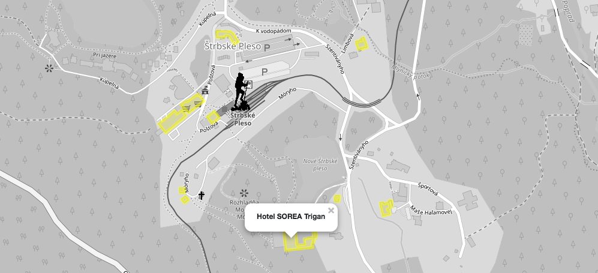

SLESARIKOVA TATIANA
# Úvod
Aplikácia ponúka zobrazenie rôznych artefaktov na mape v oblasti Vysokých Tatier. Najdôležitejšie features sú:
- zobrazenie vybratých miest (požičovňa lyží, bary, lekárne, ...) vzhľadom na aktuálnu pozíciu
- vybratie si rozsahu hľadania miest na základe počtu m a km od aktuálnej pozície
- nasimulovanie aktuálnej pozície
- zobrazenie top najbližšieho ubytovania podľa určeného limitu zobrazených ubytovaní a aktuálnej pozície
- zobrazenie cyklotrás spolu s bodmi, ktoré tieto cesty pretínajú
- zobrazenie väčších plôch s kultúrnymi atrakciami, ktoré sa tam nachádzajú 

Takto vyzerá aplikácia v chode:





Aplikácia je rozdelená na 2 časti - frontend, ktorý využíva Leaflet na zobrazovanie mapy a backend, ktorý je napísaný v Pythone spolu s frameworkom Flask. 

# Frontend
Frontend je vytvorený pomocou dvoch statických HTML stránok ('index.html' a 'polygons.html'). Mapa je zobrazovaná pomocou knižnice leaflet. Zobrazuje oblasť Vysokých Tatier spolu s vrcholmi pohorí, riekami, mestami a cestami medzi nimi. Ubytovanie sa zvýrazňuje pomocou žlej farby, cesty sú zobrazované pomocou červenej farby. Markery sú použité ako obrázky vložené do HTML kódu. Aktuálna pozícia je zobrazovaná pomocou obrázku čierneho turistu. Okruh okolo turistu je zobrazovaný modrofialovým kruhom. V tomto prípade bola ponechaná defaultná farba. V hornej časti aplikácie sa nachádza menu, kde môže používateľ selectovať artefakty, alebo vybrať iné zobrazenia.

# Backend

Backendová časť aplikácie je napísaná v jazyku Python v spolupráci s frameworkom Flask. Na prácu s databázou je využívaná knižnica [psycopg](http://initd.org/psycopg/docs/index.html). Python a Flask rieši aj spracovanie dát a formátovanie údajov.

## Dáta

Dáta sú stiahnuté priamo z Open Street Maps. Stiahnutá je časť Vysokých Tatier ako na Slovensku tak aj v Poľsku a importovaná je pomocou 'osm2pgsql' a návodu na githube. Pre zrýchlenie dopytov som vytvorila indexy - way (v tabuľke planet_osm_line a planet_osm_point), bicycle (tabuľka planet_osm_point) a amenity (tabuľka planet_osm_point). Všetky dopyty sú tvorené pomocou psycpg.cursor("dopyt").

##Query
1. scenár - zobrazenie vybratých miest (požičovňa lyží, bary, lekárne, ...) vzhľadom na aktuálnu pozíciu
```postgres
SELECT body.name, ST_AsText(body.cesta)
FROM(
	SELECT name, ST_Transform (way, 4326) as cesta 
	FROM planet_osm_point 
	WHERE amenity='parking')  as body
WHERE ST_Distance_Sphere(ST_setSRID(ST_MakePoint(20.2096027, 49.1390668), 4326), body.cesta) < 10000
```

2. scenár - zobrazenie top najbližšieho ubytovania podľa určeného limitu zobrazených ubytovaní a aktuálnej pozície
```postgres
SELECT polygons.coordinaty, polygons.cesta, polygons.name FROM (
SELECT ST_AsText (ST_Transform (way, 4326)) AS coordinaty, name, tourism, 
  		ST_Distance_Sphere(ST_setSRID(ST_MakePoint(20.2096027, 49.1390668), 4326), 
  		ST_Transform(ST_Centroid(way), 4326))  AS cesta
FROM planet_osm_polygon
WHERE tourism!='null') AS polygons
ORDER BY polygons.cesta
LIMIT 10
```

3. scenár - zobrazenie cyklotrás spolu s bodmi, ktoré tieto cesty pretínajú
```postgres
SELECT points.name, lines.name, ST_Intersects(ST_Transform(points.way, 4326), ST_Transform(lines.way, 4326)), 
       ST_AsText(ST_Transform(points.way, 4326)), ST_AsText(ST_Transform(lines.way, 4326)) 
FROM planet_osm_line as lines 
INNER JOIN planet_osm_point AS points ON (lines.bicycle = points.bicycle)
WHERE lines.bicycle='yes' and ST_Intersects(ST_Transform(points.way, 4326), ST_Transform(lines.way, 4326))='true'
```
4. scenár - zobrazenie väčších plôch s kultúrnymi atrakciami, ktoré sa tam nachádzajú
```postgres
SELECT polygon.name, ST_AsText(ST_Transform(polygon.way, 4326)), points.name,
		ST_AsText(St_Transform(points.way, 4326)), ST_Contains(polygon.way, points.way)
FROM planet_osm_polygon AS polygon
INNER JOIN planet_osm_point AS points ON (polygon.amenity = points.amenity)
```
WHERE ST_Contains(polygon.way, points.way)='true'

##Indexy
Na základe dopytov a dĺžky trvania vyhodnotenia som vytvorila takéto indexy:
```postgres
CREATE INDEX planet_osm_point_way ON planet_osm_point USING gist (way)
CREATE INDEX planet_osm_point_amenity ON planet_osm_point USING gist (amenity)

CREATE INDEX planet_osm_line_way ON planet_osm_line USING gist (way)
CREATE INDEX planet_osm_line_bicycle ON planet_osm_line USING gist (bicycle)
```
#API
```json
["contains", [
	[
		"Panny M\u00e1rie", 
		"POLYGON((19.8019603 49.1081669996656,19.8019683 49.1081661996656,19.8019704 49.1081741996656,19.8020468 49.1081684996656,19.8020345 49.1080969996656,19.8021448 49.1080871996656,19.8021574 49.1081585996656,19.8022257 49.1081524996656,19.8022372 49.1081417996656,19.8022444 49.1081442996656,19.8022321 49.1081561996656,19.8022457 49.1081995996656,19.8022964 49.1081926996656,19.8022923 49.1081801996656,19.802301 49.1081794996656,19.8023045 49.1081907996656,19.8023585 49.1081829996656,19.8023632 49.1081719996656,19.8023713 49.1081733996656,19.8023663 49.1081844996656,19.8023989 49.1081993996656,19.8024136 49.1081932996656,19.8024188 49.1081979996656,19.802403 49.1082051996656,19.8024121 49.1082291996656,19.8024297 49.1082299996656,19.8024287 49.1082355996656,19.8024112 49.1082348996656,19.8023907 49.1082598996656,19.8024032 49.1082683996656,19.8023963 49.1082725996656,19.8023815 49.1082617996656,19.8023546 49.1082650996655,19.8023865 49.1083092996655,19.8023745 49.1083144996655,19.8023686 49.1083050996655,19.80231 49.1083228996655,19.8023166 49.1083321996655,19.802304 49.1083361996655,19.802273 49.1082930996655,19.8022609 49.1082959996656,19.8022577 49.1082879996655,19.8022278 49.1082922996656,19.8022443 49.1083391996656,19.8022352 49.1083409996655,19.8022183 49.1082941996656,19.8021917 49.1082974996656,19.8021941 49.1083054996656,19.8021741 49.1083079996655,19.8021724 49.1083000996655,19.8021154 49.1083053996655,19.8021172 49.1083122996655,19.8020947 49.1083146996655,19.8020936 49.1083078996655,19.8020362 49.1083132996655,19.8020364 49.1083189996655,19.8020111 49.1083201996655,19.8020147 49.1083304996655,19.8020004 49.1083332996655,19.8019603 49.1081669996656))", 
		"Panny M\u00e1rie", 
		"POINT(19.802143 49.1082399996656)", 
		"True"
	], 
	[
		"Zesp\u00f3\u0142 Pa\u0144stwowych Szk\u00f3\u0142 Artystycznych", 
		"POLYGON((19.9601148 49.2958886996194,19.9601591 49.2958577996194,19.9602227 49.2957884996194,19.9603681 49.2956481996194,19.9606895 49.2958314996194,19.9603485 49.2960808996193,19.9602239 49.2960131996193,19.9601815 49.2959838996194,19.9601633 49.2959292996194,19.9601148 49.2958886996194))", 
		"Pa\u0144stwowa Szko\u0142a Muzyczna I st. im. Mieczys\u0142awa Kar\u0142owicza", 
		"POINT(19.960373 49.2959358996194)", 
		"True"
	], 
	[
		"Zesp\u00f3\u0142 Pa\u0144stwowych Szk\u00f3\u0142 Artystycznych", 
		"POLYGON((19.9601148 49.2958886996194,19.9601591 49.2958577996194,19.9602227 49.2957884996194,19.9603681 49.2956481996194,19.9606895 49.2958314996194,19.9603485 49.2960808996193,19.9602239 49.2960131996193,19.9601815 49.2959838996194,19.9601633 49.2959292996194,19.9601148 49.2958886996194))", 
		"Pa\u0144stwowa Og\u00f3lnokszta\u0142c\u0105ca Szko\u0142a Artystyczna", 
		"POINT(19.9604671 49.2958250996194)", 
		"True"
	], 
	[
		"Zvestovania P\u00e1na", 
		"POLYGON((20.2667867 49.1223006996621,20.2667899 49.1222884996621,20.2668266 49.1222921996621,20.2668673 49.1222835996621,20.2668568 49.1222652996621,20.266905 49.1222524996621,20.2668881 49.1222246996621,20.2669268 49.1222149996621,20.2669437 49.1222426996621,20.2670251 49.1222210996621,20.26703 49.1222302996621,20.2671088 49.1222097996621,20.2671598 49.1222894996621,20.2670682 49.1223117996621,20.2670604 49.1222990996621,20.2669057 49.1223402996621,20.266896 49.1223240996621,20.2668521 49.1223359996621,20.2668408 49.1223501996621,20.2668278 49.1223461996621,20.266838 49.1223297996621,20.2668209 49.1223032996621,20.2667867 49.1223006996621))", 
		"nothing", 
		"POINT(20.2670777 49.1222663996621)", 
		"True"
	], 
	[
		"Klasztor Albertynek na Kalat\u00f3wkach", 
		"POLYGON((19.974622 49.2639719996272,19.9748754 49.2638884996272,19.9748884 49.2639052996272,19.9749646 49.2638802996272,19.9748332 49.2637094996273,19.9748055 49.2637185996273,19.9747384 49.2636315996273,19.9747645 49.2636229996273,19.9747423 49.2635941996273,19.9749425 49.2635281996273,19.9749595 49.2635500996273,19.9749903 49.2635398996273,19.975094 49.2636746996273,19.9749448 49.2637238996273,19.9750626 49.2638799996272,19.9751263 49.2638589996272,19.9751646 49.2639086996272,19.9749866 49.2639672996272,19.9749574 49.2639291996272,19.9746636 49.2640259996272,19.974622 49.2639719996272))", 
		"Kaplica Ku\u017anice", 
		"POINT(19.9748244 49.2639289996272)", 
		"True"
	]
]
]
```
